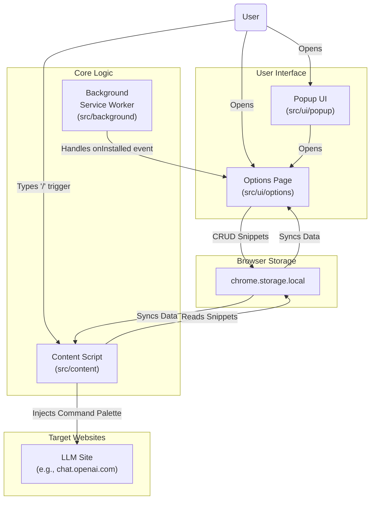

# Promply

Your AI prompt assistant - store, search, and insert prompts seamlessly into ChatGPT, Claude, and Gemini.


## Features

- **Store and Manage Prompts:** Easily save, edit, and delete your favorite prompts.
- **Inject Prompts into LLM Websites:** Quickly insert your prompts into popular LLM websites like ChatGPT, Gemini, and Claude.
- **Fuzzy Search:** Find the prompt you're looking for with a powerful fuzzy search.
- **Cross-Browser Support:** Works on Chrome and Firefox.

## Architecture



## Usage

1. Navigate to a supported website (e.g., [chat.openai.com](https://chat.openai.com), [gemini.google.com](https://gemini.google.com), or [claude.ai](https://claude.ai)).
2. Click inside any text input field or textarea.
3. Type the activator character: `/`
4. A command palette will appear. Start typing to fuzzy-search for your saved snippets.
5. Click on the desired snippet to insert it into the text field.

> **Note:** The ability to configure the activator key is a planned feature.

## Development

1. **Clone the repository:**

  ```bash
  git clone https://github.com/your-username/promply.git
  cd promply
  ```

2. **Install dependencies:**

  ```bash
  npm install
  ```

3. **Start the development server:**

  ```bash
  npm run dev
  ```

  This command will watch for file changes and automatically rebuild the extension to the `dist` directory.

4. **Load the extension in your browser:**

  ### Google Chrome

  - Navigate to `chrome://extensions`.
  - Enable "Developer mode" using the toggle in the top-right corner.
  - Click the "Load unpacked" button.
  - Select the `dist` directory from this project.

  ### Mozilla Firefox

  - Navigate to `about:debugging`.
  - Click "This Firefox" in the sidebar.
  - Click the "Load Temporary Add-on..." button.
  - Select the `manifest.json` file inside the `dist` directory from this project.

## Building

- `npm run build:chrome`
- `npm run build:firefox`

## Contributing

We welcome contributions! Please see our [Contributing Guide](CONTRIBUTING.md) for more information.
